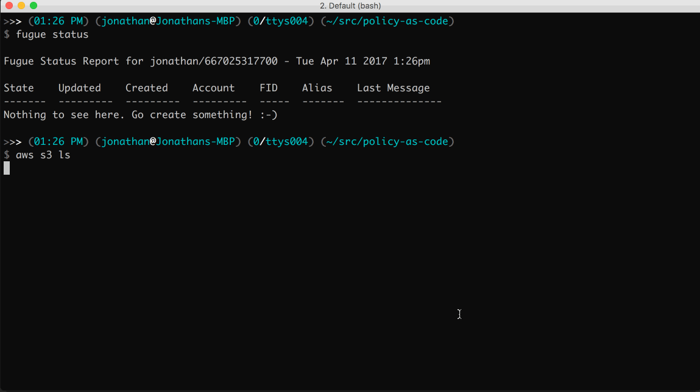

# Policy As Code Demo

## Fugue Setup

Notes:

* All credentials shown in the README were setup solely for this demo. They have since been deleted and will not work.
* We tested this with Firefox. For us, the Jenkins web UI misbehaved in Chrome.
* If you run this on an EC2 instance, ensure you pick an instance type with enough CPU to support multiple `fugue run`'s at the same time (`t2.large` works nicely). If you use up all the CPU credits `fugue run` may timeout on compilation.

### Install the Fugue Client tools

Download and install the Fugue Client tools from the [Download Portal](https://download.fugue.co/).  Please refer to the [installation documentation](https://docs.fugue.co/fugue-by-example-hello-world-1.html#fugue-quick-setup) on the [Fugue docs site](https://docs.fugue.co/).

### Install the Fugue Conductor

Initialize the project and install the Fugue Conductor.

```
$ fugue init <conductor-ami>
$ fugue install
```


The `fugue.yaml` in the project directory should now have the Conductor `root` credentials at the bottom of the file.  This is not an AWS root account user, this is root account that manages the Fugue Conductor.  These are put in place during the `fugue install`.  Make note of the `userSecret` on the last line (if you ever lose it, [here are the recovery steps](https://docs.fugue.co/user-guide-troubleshooting.html#troubleshooting-reset-secret)).  Later, we're going to add this credential to the Jenkins credential store. 

## Compile Time Validations

We can validate our infrastructure by ensuring all our compositions and Ludwig libraries compile. That's what the `Makefile` does for you. We'll run through some categories of validation below.

```
$ ENVIRONMENT=DEV make
```


### Environments: Only allow approved environments.

```
$ ENVIRONMENT=DOESNOTEXIST make
```


### Regions: Only allow `us-east-1`.

```
$ ENVIRONMENT=DEV make
```


### Ports: SSH allowed for DEV environment *only*, disallowed for QA and PROD.

```
$ ENVIRONMENT=DEV make
$ ENVIRONMENT=QA make
$ ENVIRONMENT=PROD make
```


### Tags: All assets that can be tagged must have specific standard tags applied.

```
$ ENVIRONMENT=DEV make
```


### InstanceTypes: Limit allowed instances types on a library-by-library basis.

```
$ ENVIRONMENT=DEV make
```


## Continuous Integration Setup

Now, we'll set up a Jenkins server using Fugue, and enable that Jenkins server to use Fugue to push infrastructure changes based on compositions in a GitHub repository.

### Deploy our Artifact Repository (S3 Bucket)

First, we'll set up an artifact repository to hold our Fugue Client artifacts so Jenkins can get them.  Edit the `CreateArtifactRepo.lw` composition and make sure to **choose a S3 bucket name that doesn't already exist**.  The Amazon S3 bucket names are part of a global namespace so make sure you pick something that's not going to be already taken by someone else.

```
$ aws s3 ls
$ ENVIRONMENT=DEV fugue run compositions/CreateArtifactRepo.lw -a Repo
```



Check to make sure it was successful.  If it wasn't successful, run `fugue status Repo | grep last` and make sure you didn't pick a S3 bucket name that was already taken.

### Upload the Fugue client artifacts to our Artifact Repository

Now, let's upload the Fugue Client and Support packages to our artifact repo.

* Note: You'll want to change the S3 bucket name in this example, `myFugueArtifact`, to match your bucket name.

```
$ aws s3 ls
$ aws s3 cp fugue-client_0.27.12-1807_amd64.deb s3://myFugueArtifact/
$ aws s3 cp fugue-support_0.5.0-306_amd64.deb s3://myFugueArtifact/
OR
$ ./bin/uploadArtifacts.sh myFugueArtifact
```


## Deploy Jenkins

Run the composition to stand up Jenkins.

```
$ ENVIRONMENT=DEV fugue run compositions/CreateJenkins.lw -a Jenkins
```


## Configure Jenkins

Get the DNS name of the Jenkins ELB.

```
$ ./bin/getElbDnsName.sh Jenkins
Jenkins-elb-2090978611.us-east-1.elb.amazonaws.com
```

Open the DNS name in a browser.  You'll be prompted to ssh into the Jenkins node to obtain the inital password by viewing the contents of the file `/var/lib/jenkins/secrets/initialAdminPassword`.  Get the public IP address of the Jenkins node via the AWS console and ssh in as the user `ubuntu`.

```
$ ssh -l ubuntu 184.73.12.111 sudo cat /var/lib/jenkins/secrets/initialAdminPassword
807803cb0cec426f8b42a1bd0c317e7b
OR
$ ./bin/getJenkinsPassword.sh 184.73.12.111
807803cb0cec426f8b42a1bd0c317e7b
```

Get the password and log into Jenkins using the web UI. Install the suggested plugins.  When the plugins are finished installing create the first `admin` user and `Save and Finish`. Click on `Start using Jenkins`.


### Add credentials to Jenkins.  

These will be used to authenticate to the Fugue Conductor, AWS, and optionally your source code management system.


Create a new `Multibranch Pipeline` job and add the Jenkins File.


## GitFlow of Infrastructure with Fugue and Jenkins

Create feature branch off the develop branch and push it up to our SCM.  If it fails compile time validation, fix it, and push it back up to our SCM.  Fugue and Jenkins will validate the infrastructure and then deploy it on our behalf.


Once the job is finished running and Fugue has finished deploying the feature branch connect to our developer environement and verify that it's up.


## Tearing it down

Remove all the contents from our artifact repository and then kill the Fugue processes.

```
$ aws s3 ls
$ aws s3 rm s3://myFugueArtifact --recursive
$ fugue kill -y feature/test-validations
$ fugue kill -y develop
$ fugue kill -y production
$ fugue kill -y Jenkins
$ fugue kill -y Repo
```
